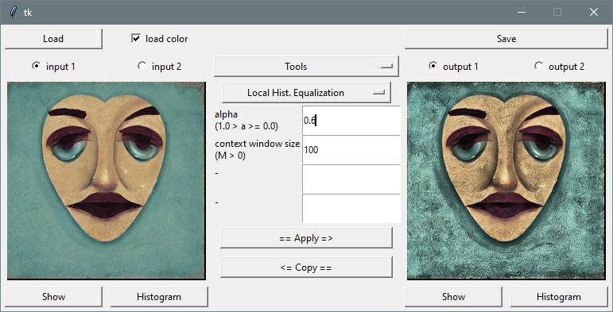

# ImageProcessingPython
GUI application to perform different image processing operations, fully implemented in python.

## Example



## Setup

1. Clone the repository
2. Install conda environment
``` conda env create -f environment.yml ```
3. Activate the environment 
``` conda activate ipp ```
4. Run the application
``` python main.py ```

## Features

TBD

## License

MIT License

## Author

Dennis Wittich
